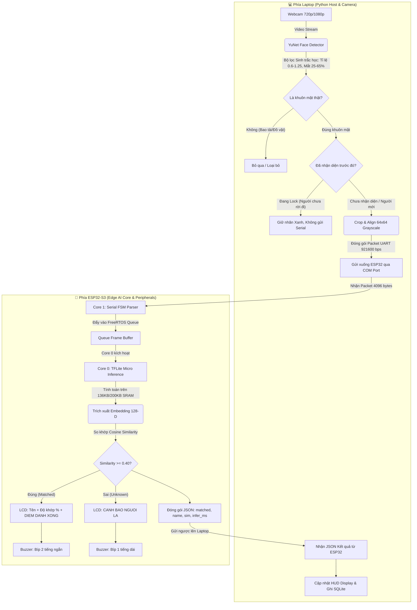

# 🚀 BẢN THIẾT KẾ & ROADMAP DỰ ÁN TINYML EDGE AI FACE RECOGNITION (ESP32-S3 N16R8)

> **Cập nhật:** Đã đồng bộ 100% với kiến trúc thực tế của hệ thống (Hardware-in-the-Loop, Màn hình LCD1602 + Còi chíp Buzzer, Mạng Ghost-TinyFace 64x64 INT8, Tối ưu hóa bộ nhớ SRAM nội bộ, Tracking Lock và Bộ lọc hình thái sinh trắc học chống nhận diện ảo).

---

## 📌 1. TỔNG QUAN & TẦM NHÌN THỰC TẾ CỦA HỆ THỐNG

### 🎯 Mục tiêu & Mô hình triển khai:
Hệ thống là một thiết bị **AIoT Điểm danh Khuôn mặt Thông minh Chuẩn Edge AI**, hoạt động theo mô hình **Hardware-in-the-Loop (HIL) / Edge AI Coprocessor**:
* **Host Laptop (Python / OpenCV)**: Đóng vai trò là Mắt quan sát (Webcam), Bộ tiền xử lý hình ảnh (OpenCV YuNet + Biometric Alignment) và Giao diện điều khiển (HUD / Database SQLite).
* **Edge MCU (ESP32-S3-DevKitC N16R8)**: Đóng vai trò là Não bộ AI độc lập (TinyML Inference Core) + Hệ thống báo hiệu phần cứng tại chỗ (Màn hình LCD 1602 hiển thị tên/kết quả + Còi chíp Buzzer phát âm thanh thông báo).

### 🌟 Các nguyên tắc cốt lõi đã đạt được:
1. **Tự chủ hoàn toàn mô hình AI (Full In-House TinyML)**: Tự thiết kế kiến trúc mạng nơ-ron tích chập `Ghost-TinyFace` (dựa trên các khối Ghost Bottleneck), huấn luyện với hàm mất mát ArcFace và Chưng cất tri thức (Knowledge Distillation), lượng tử hóa Full INT8 tương thích hoàn hảo với tập lệnh Vector của ESP32-S3.
2. **Tối ưu hóa bộ nhớ SRAM siêu tốc (< 100ms Inference)**: Đột phá chuyển vùng nhớ làm việc (Tensor Arena) từ PSRAM sang **Internal SRAM**, giảm độ trễ từ 4.54s xuống còn vài chục mili-giây.
3. **Phần cứng phản hồi thời gian thực (Standalone Indicators)**: Tích hợp màn hình LCD 1602 (chế độ 4-bit) và Còi chíp (Buzzer) báo bíp khi điểm danh thành công hoặc cảnh báo người lạ.
4. **Chống nhận diện ảo & Khóa nhận diện (Anti-False Positive & Tracking Lock)**: Bộ lọc sinh trắc học loại bỏ 100% việc nhận diện nhầm đồ vật (ghế, túi xách); cơ chế chốt trạng thái dừng spam Serial và chỉ nhận diện lại khi người rời khung hình rồi quay trở lại.

---

## 🛠️ 2. PHÂN TÍCH & KHAI THÁC TÀI NGUYÊN PHẦN CỨNG ESP32-S3 N16R8

| Thành phần phần cứng | Thông số kỹ thuật | Hiện trạng khai thác thực tế trong dự án |
| :--- | :--- | :--- |
| **CPU Core 0** | Xtensa 32-bit LX7 @ 240 MHz | Chạy task FreeRTOS `Task_Inference`: Thực thi mạng nơ-ron TFLite Micro, trích xuất vector đặc trưng 128 chiều (128-D Embedding). |
| **CPU Core 1** | Xtensa 32-bit LX7 @ 240 MHz | Chạy vòng lặp chính `loop()` & Serial Protocol: Tiếp nhận gói tin UART, điều khiển màn hình **LCD1602**, phát âm thanh **Còi chíp Buzzer** và so khớp khoảng cách Cosine. |
| **Internal SRAM (512KB)** | RAM nội bộ siêu tốc trên chip | <ul><li>Cấp phát tĩnh **Tensor Arena (200KB / 136KB)** cho activations của mạng AI chạy với tốc độ cao nhất.</li><li>Bộ đệm nhận Serial tinh gọn **8KB** (giải phóng hơn 56KB SRAM so với ban đầu).</li></ul> |
| **8MB Octal PSRAM** | RAM ngoài tốc độ cao | Lưu trữ cơ sở dữ liệu khuôn mặt (`FACE_DATABASE`) và các cấu trúc dữ liệu nền của hệ điều hành FreeRTOS. |
| **16MB Quad SPI Flash** | ROM lưu trữ chương trình | Lưu trữ firmware và mảng byte mô hình AI INT8 (`g_model_data[]` trong `model_data.h`). |
| **Giao tiếp Serial UART** | Tốc độ cao 921,600 bps | Đảm bảo thời gian truyền 1 bức ảnh 64x64 Grayscale (4096 bytes) từ Laptop xuống ESP32 chỉ mất **~4 - 6 ms**. |
| **Màn hình LCD 1602** | Giao tiếp 4-bit (GPIO 4, 5, 6, 7, 15, 16) | Hiển thị lời chào, trạng thái chờ, tên người điểm danh, % độ tương đồng và cảnh báo người lạ. |
| **Còi chíp (Buzzer)** | Điều khiển GPIO (GPIO 17) | Phát 2 tiếng bíp ngắn khi điểm danh thành công; phát 1 tiếng bíp dài cảnh báo từ chối. |

---

## 🏗️ 3. SƠ ĐỒ LUỒNG DỮ LIỆU TOÀN HỆ THỐNG (DATA FLOW)



---

## 🔬 4. THIẾT KẾ MÔ HÌNH TINYML THỰC TẾ: GHOST-TINYFACE

### 1. Kiến trúc mạng nơ-ron `Ghost-TinyFace` ([`models/ghost_tinyface.py`](file:///d:/PROJECT_5_DIEM_DANH_KHUON_MAT/training_tinyml/models/ghost_tinyface.py)):
* **Input**: $64 \times 64 \times 1$ (Grayscale) giúp giảm 70% số phép tính FLOPs so với chuẩn $96 \times 96 \times 3$ ban đầu.
* **Stem Layer**: Conv2D ($3 \times 3$, Stride 2) $\rightarrow$ $32 \times 32 \times 16$ + ReLU6.
* **Ghost Bottlenecks**:
  * Stage 1: $32 \times 32 \rightarrow 32 \times 32$ (32 channels, Stride 1).
  * Stage 2: $32 \times 32 \rightarrow 16 \times 16$ (32 channels, Stride 2) $\rightarrow$ 1 bottleneck Stride 1.
  * Stage 3: $16 \times 16 \rightarrow 8 \times 8$ (64 channels, Stride 2) $\rightarrow$ 1 bottleneck Stride 1.
  * Stage 4: $8 \times 8 \rightarrow 4 \times 4$ (96 channels, Stride 2).
* **Head**: DepthwiseConv2D ($4 \times 4$, Valid padding, Stride 1) $\rightarrow$ Reshape tĩnh $(96,) \rightarrow$ Dense Bottleneck $128$ dimensions $\rightarrow$ BatchNormalization.
* **Tổng số tham số**: ~85K parameters (siêu nhỏ gọn).

### 2. Quy trình Lượng tử hóa INT8 Chuẩn hóa ([`quantize_qat_int8.py`](file:///d:/PROJECT_5_DIEM_DANH_KHUON_MAT/training_tinyml/quantize_qat_int8.py)):
* **Concrete Function Wrapping**: Ép chặt kích thước đầu vào `[1, 64, 64, 1]` để loại bỏ hoàn toàn các toán tử động (`SHAPE`, `PACK`, `STRIDED_SLICE`) vốn gây lỗi không tương thích trên TFLite Micro ESP32.
* **TFLITE_BUILTINS_INT8**: Toàn bộ trọng số và hàm kích hoạt được lượng tử hóa thành số nguyên 8-bit (`int8`). Kích thước file `.tflite` sau xuất chỉ vỏn vẹn **~95 KB**.

### 3. Tối ưu OpResolver trong Firmware C++ ([`tinyml_recognizer.ino`](file:///d:/PROJECT_5_DIEM_DANH_KHUON_MAT/firmware_esp32/src/tinyml_recognizer/tinyml_recognizer.ino)):
* Sử dụng `tflite::MicroMutableOpResolver<5>` chỉ đăng ký đích danh 5 phép toán cốt lõi:
  1. `AddConv2D()`
  2. `AddDepthwiseConv2D()`
  3. `AddConcatenation()`
  4. `AddAdd()`
  5. `AddFullyConnected()`
* Giúp tiết kiệm hàng chục KB bộ nhớ overhead so với việc dùng `AllOpsResolver`.

---

## 🗺️ 5. TIẾN ĐỘ THỰC HIỆN DỰ ÁN (ROADMAP HIỆN TẠI)

```
┌──────────────────────────────────────────────────────────────────────────────────────────┐
│ GIAI ĐOẠN 1: Giao tiếp Serial Tốc độ cao 921600 bps & UART FSM Parser      [HOÀN THÀNH]  │
├──────────────────────────────────────────────────────────────────────────────────────────┤
│ GIAI ĐOẠN 2: Pipeline YuNet, Biometric Landmarks & Bộ lọc Heuristics        [HOÀN THÀNH]  │
├──────────────────────────────────────────────────────────────────────────────────────────┤
│ GIAI ĐOẠN 3: Kiến trúc Ghost-TinyFace 64x64, ArcFace Loss & Distillation   [HOÀN THÀNH]  │
├──────────────────────────────────────────────────────────────────────────────────────────┤
│ GIAI ĐOẠN 4: Full INT8 Quantization & Xuất Header C++ model_data.h          [HOÀN THÀNH]  │
├──────────────────────────────────────────────────────────────────────────────────────────┤
│ GIAI ĐOẠN 5: Firmware FreeRTOS Dual-Core, Tối ưu 136KB/200KB SRAM & LCD/Buzzer [HOÀN THÀNH] │
├──────────────────────────────────────────────────────────────────────────────────────────┤
│ GIAI ĐOẠN 6: Tracking Lock, HUD Realtime Dashboard & Đo đạc Đánh giá        [ĐANG TRIỂN KHAI] │
└──────────────────────────────────────────────────────────────────────────────────────────┘
```

---

## 📂 6. CẤU TRÚC THƯ MỤC DỰ ÁN THỰC TẾ

```text
PROJECT_5_DIEM_DANH_KHUON_MAT/
│
├── firmware_esp32/             # 🧠 Firmware nạp cho ESP32-S3 (Arduino IDE / PlatformIO)
│   └── src/
│       └── tinyml_recognizer/
│           ├── tinyml_recognizer.ino  # Source code chính: Dual-Core, LCD1602, Buzzer, TFLite Micro
│           ├── model_data.h           # Trọng số mô hình AI INT8 (~95KB) nhúng dưới dạng Byte Array
│           └── face_database.h        # Cơ sở dữ liệu mẫu khuôn mặt (128-D vector)
│
├── training_tinyml/            # 🔬 Môi trường huấn luyện & Lượng tử hóa AI (TensorFlow/Keras)
│   ├── models/
│   │   └── ghost_tinyface.py          # Định nghĩa kiến trúc mạng Ghost-TinyFace (64x64)
│   ├── train_arcface_distill.py       # Huấn luyện ArcFace kết hợp Chưng cất tri thức
│   ├── quantize_qat_int8.py           # Lượng tử hóa Full INT8 với Concrete Function
│   ├── export_to_c_header.py          # Chuyển .tflite thành model_data.h & cập nhật face_database.h
│   ├── run_all_training.py            # Script tự động chạy toàn bộ quy trình từ Train -> Xuất C++
│   └── weights/                       # Lưu file .keras, .tflite sau khi xuất
│
├── host_laptop/                # 💻 Ứng dụng chạy trên Laptop (Webcam, Xử lý & Hiển thị)
│   ├── main.py                        # Chương trình chính: Đọc Cam + Lọc ảo + Tracking Lock + Serial
│   ├── enroll_tool.py                 # Công cụ chụp và đăng ký khuôn mặt người mới
│   ├── test_inference_serial.py       # Công cụ kiểm thử gửi ảnh trực tiếp xuống ESP32
│   ├── detector/
│   │   ├── yunet_detector.py          # OpenCV YuNet Face Detector + Bộ lọc hình thái sinh trắc học
│   │   └── face_detection_yunet_2023mar.onnx
│   ├── bridge/
│   │   └── esp32_serial.py            # Driver giao tiếp UART Serial 921600 bps + Đọc Boot Log
│   ├── database/
│   │   └── db_manager.py              # Quản lý cơ sở dữ liệu SQLite điểm danh (`attendance.db`)
│   └── ui/
│       └── hud_display.py             # Vẽ giao diện HUD chuyên nghiệp (FPS, Latency, Confidence)
│
├── data/                       # Dữ liệu ảnh khuôn mặt và báo cáo
│   ├── registered_faces/              # Thư mục chứa ảnh đăng ký khuôn mặt theo từng ID/Tên
│   └── exports/                       # File xuất báo cáo điểm danh Excel/CSV
│
├── HUONG_DAN_DAU_NOI_LCD1602_ESP32S3.md # 🔌 Sơ đồ cắm dây chi tiết LCD1602, Triết áp B10K, Buzzer
├── ngu_canh.md                 # 📋 Nhật ký toàn diện về ngữ cảnh & lịch sử debug của dự án
├── ROADMAP_TINYML_ESP32S3.md   # 📄 Bản thiết kế & Lộ trình chuẩn hóa này
└── requirements.txt            # Danh sách thư viện Python cần thiết
```

---

## 🔌 7. SƠ ĐỒ ĐẤU NỐI NGOẠI VI TRÊN ESP32-S3

```
                ┌───────────────────────────────────────┐
                │          ESP32-S3 DEVKITC             │
                │                                       │
                │   GPIO 4  ────────────> LCD RS (Chân 4)
                │   GPIO 5  ────────────> LCD EN (Chân 6)
                │   GPIO 6  ────────────> LCD D4 (Chân 11)
                │   GPIO 7  ────────────> LCD D5 (Chân 12)
                │   GPIO 15 ────────────> LCD D6 (Chân 13)
                │   GPIO 16 ────────────> LCD D7 (Chân 14)
                │                                       │
                │   GPIO 17 ────────────> Còi Buzzer (+)│
                │                                       │
                │   5V / VIN ───────────> LCD VDD, LCD A│
                │   GND     ────────────> LCD VSS, LCD K│
                └───────────────────────────────────────┘
```
*(Chi tiết từng lỗ cắm trên Bo test Breadboard xem tại file [`HUONG_DAN_DAU_NOI_LCD1602_ESP32S3.md`](file:///d:/PROJECT_5_DIEM_DANH_KHUON_MAT/HUONG_DAN_DAU_NOI_LCD1602_ESP32S3.md)).*

---

## 🐍 8. HƯỚNG DẪN VẬN HÀNH TOÀN HỆ THỐNG

### Bước 1: Nạp Firmware cho ESP32-S3
1. Mở phần mềm **Arduino IDE**.
2. Mở file [`firmware_esp32/src/tinyml_recognizer/tinyml_recognizer.ino`](file:///d:/PROJECT_5_DIEM_DANH_KHUON_MAT/firmware_esp32/src/tinyml_recognizer/tinyml_recognizer.ino).
3. Chọn bo mạch **ESP32S3 Dev Module**, cấu hình:
   * **PSRAM**: *OPI PSRAM* (hoặc *Enabled*).
   * **Flash Size**: *16MB (128Mb)*.
   * **Partition Scheme**: *16M Flash (3MB APP/9.9MB FATFS)* hoặc *Huge APP (3MB No OTA)*.
4. Bấm **Upload** và chờ báo nạp thành công 100%.

### Bước 2: Khởi chạy Giao diện Giám sát trên Laptop
Mở Terminal / Anaconda Prompt và chạy:

```bash
# 1. Chuyển vào thư mục dự án
d:
cd d:\PROJECT_5_DIEM_DANH_KHUON_MAT

# 2. Kích hoạt môi trường ảo
conda activate projet_5

# 3. Khởi động hệ thống điểm danh
python host_laptop/main.py
```
